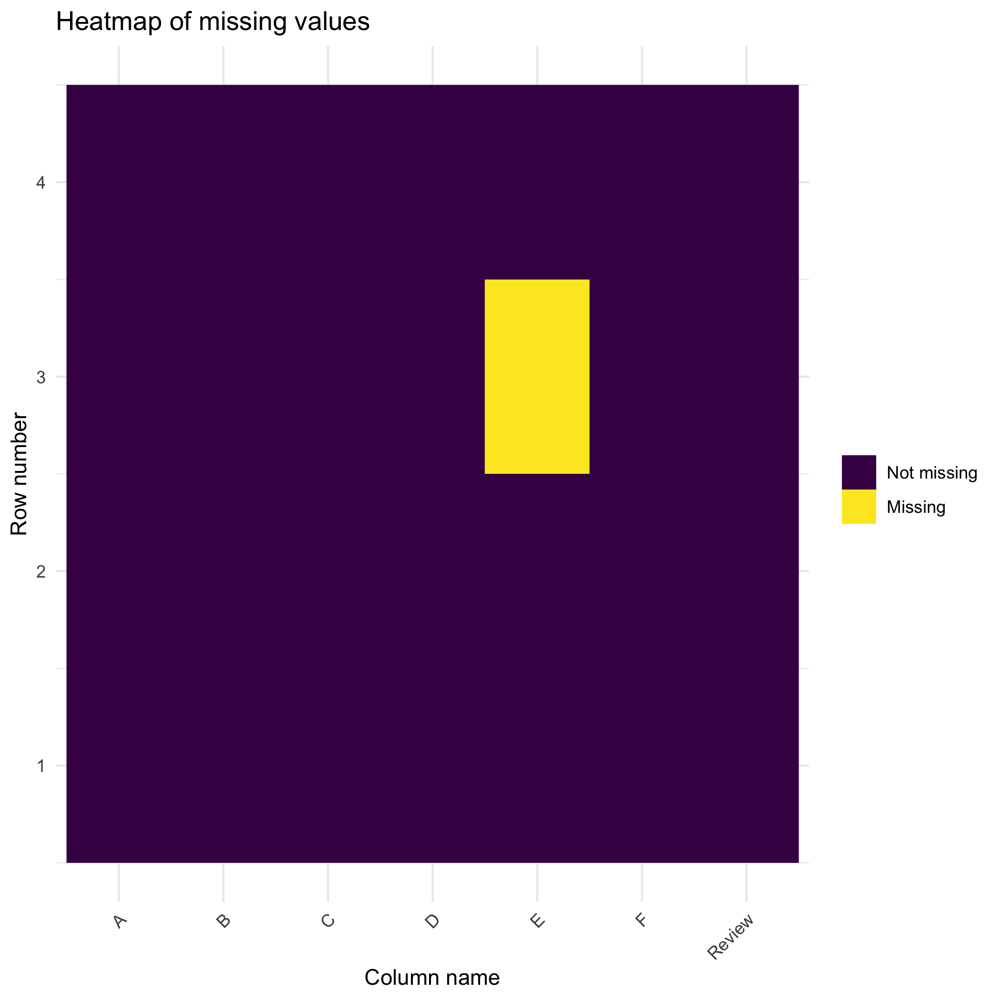
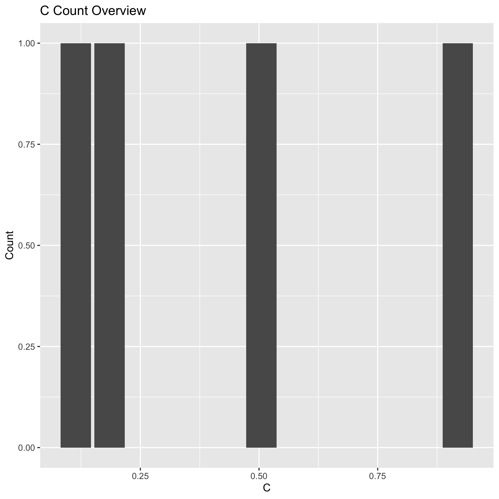
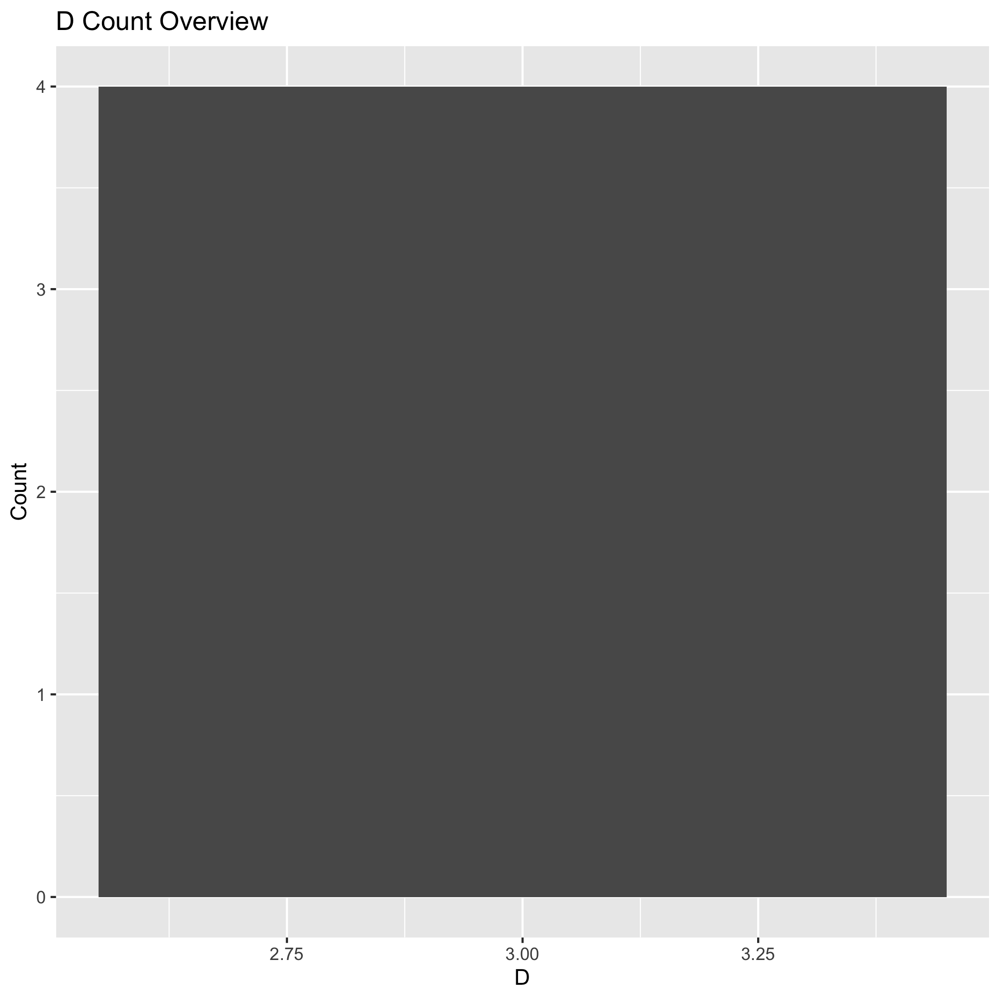

<!-- README.md is generated from README.Rmd. Please edit that file -->

# RDataPeek

<!-- badges: start -->

[](https://github.com/UBC-MDS/RDataPeek/actions)
[](https://codecov.io/gh/UBC-MDS/RDataPeek?branch=master)
<!-- badges: end -->

## Project Proposal

Data scientists are expected to orient business users to the datasets by
analyzing in a way that is accessible and easy to understand. This
process is the first step to building trust in the analysis.

RDataPeek is a package that enables data scientists to efficiently
generate a visual summary of a dataset. This package includes functions
that show the size of the dataset, a visual summary of missing data, a
sample of the dataset showing the data types as well as exploratory
visualizations for quantitative and qualitative data.

This package is also useful for business users who have to interact with
data and want to begin exploring the data without using too much code or
having to open a potentially large dataset on Excel.

### Functions in this package

All functions take in csv or Excel files as inputs to generate
user-friendly summaries of the ingested dataset.

1.  **missing\_data\_overview()**: Returns a visualization of the data
    where missing values are highlighted and the number of rows and
    columns are visually displayed. A heatmap will be used here to
    highlight the missing values so it’s easy for users to have an
    overview of which part is missing in the data.

2.  **sample\_data()**: Returns a dataframe that displays the column
    names as rows, an example of one row, the data type of each column
    and summary statistics for each column depending on the data type.
    Numeric data is summarized with mean of all value and character data
    is summarized with average length of string.

3.  **explore\_w\_histograms()**: Returns saved png files of histograms
    that shows the distribution of responses for given columns. The
    given list of numerical columns can be chosen by user.

4.  **word\_bubble()**: Returns a saved word bubble visualization for
    text data given column name. This would allow users to know what are
    the most frequently used words for each column in a short time.

### How this fits in the R ecosystem

Several R packages and functions are available that support exploratory
data analysis but none are specific to the targeted use cases here - a
simple and technologically friendly way of summarizing data.

  - [Base R’s
    `summary()`](https://www.rdocumentation.org/packages/base/versions/3.6.2/topics/summary):
    This function computes summary statistics for R dataframes. Our
    package differs in that it aims to offer summary statistics
    dependent on data type, including long form text data.

  - [R ggplot2](https://ggplot2.tidyverse.org): Our package will
    leverage `ggplot2` to create visualizations that summarize the
    dataset as well as user-defined features in the dataset. There are
    existing recommended visualizations for exploratory data analysis
    such as [missing data
    visualizations](https://cran.r-project.org/web/packages/naniar/vignettes/naniar-visualisation.html)
    which will be adapted where appropriate.

  - [R Word
    Cloud](https://cran.r-project.org/web/packages/wordcloud/wordcloud.pdf):
    This package will also be used to create summary visualizations for
    long form text data.

## Installation

The development version from [GitHub](https://github.com/) with:

``` r
install.packages("devtools")
devtools::install_github("UBC-MDS/RDataPeek")
```

## Example

### Data: `vignettes/example.csv`

``` r
readr::read_csv("vignettes/example.csv", col_types = col_type)
#> Warning: The following named parsers don't match the column names: movies
#> # A tibble: 4 x 7
#>       A B              C     D E     F     Review                               
#>   <dbl> <date>     <dbl> <dbl> <chr> <chr> <chr>                                
#> 1     1 2013-01-02 0.919     3 test  foo   "But it's not. The plot isn't all th…
#> 2     1 2013-01-02 0.505     3 train foo   "Young couple on the road, minding t…
#> 3     1 2013-01-02 0.185     3 <NA>  foo   "Apparently, in the eyes of some - t…
#> 4     1 2013-01-02 0.114     3 train foo   "I won't spoil it for you. Although …
```

*This is a basic example which shows you how to solve a common problem:*

### View Summary Statistics of Data

    library(RDataPeek)
    RDataPeek::sample_data("example.csv")

``` r
readr::read_csv("vignettes/0_summary.csv", col_types = col_type)
#> Warning: Missing column names filled in: 'X1' [1]
#> # A tibble: 7 x 5
#>      X1 columns sample_record                          data_type summary        
#>   <dbl> <chr>   <chr>                                  <chr>     <chr>          
#> 1     1 A       "1"                                    numeric   Mean value is:…
#> 2     2 B       "2013-01-02"                           Date      No summary ava…
#> 3     3 C       "0.9186815"                            numeric   Mean value is:…
#> 4     4 D       "3"                                    numeric   Mean value is:…
#> 5     5 E       "test"                                 character Number of uniq…
#> 6     6 F       "foo"                                  character Number of uniq…
#> 7     7 Review  "But it's not. The plot isn't all tha… character Number of uniq…
```

### Missing Data Overview

    RDataPeek::missing_data_overview("example.csv")



### Word Bubble

    RDataPeek::word_bubble("example.csv", column = "Review")

``` r

```


### Explore\_w\_histograms

    RDataPeek::explore_w_histograms("example.csv", columns_list = c("C", "D"))

``` r

```


``` r

```


